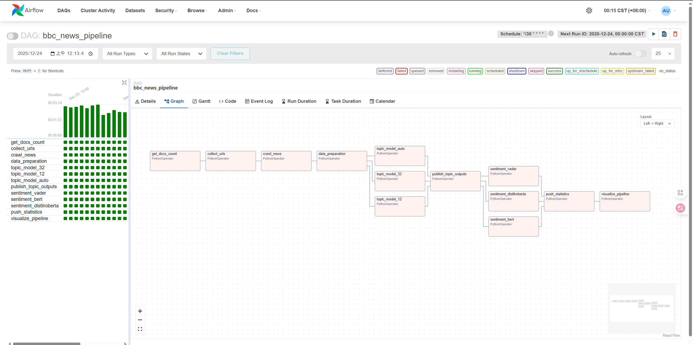

# BBC News Scraper & NLP Pipeline

以 Apache Airflow 為排程與管線協調核心，整合 Scrapy 爬蟲、MongoDB 儲存、NLP（文字前處理、主題模型、情感與情緒分析）、統計圖表輸出，並透過 Docker Compose 一鍵啟動整套自動化新聞資料分析系統。

---

## 目錄

1. [專案總覽](#專案總覽)
2. [系統架構](#系統架構)
3. [技術棧](#技術棧)
4. [目錄結構說明](#目錄結構說明)
5. [環境需求](#環境需求)
6. [如何啟動專案](#如何啟動專案)
7. [Airflow DAG 流程說明](#airflow-dag-流程說明)
8. [Scrapy 爬蟲專案說明](#scrapy-爬蟲專案說明)
9. [NLP / 情緒分析 / 主題模型](#nlp--情緒分析--主題模型)
10. [視覺化輸出與報表](#視覺化輸出與報表)
---

## 專案總覽

本專案旨在建立一條完整、自動化的 BBC News 資料分析管線，能夠週期性執行以下任務：

1. 透過 BBC Sitemap 自動蒐集最新新聞網址
2. 使用 Scrapy 爬蟲抓取 BBC 新聞內容並存入 MongoDB
3. 對新聞內容進行文字前處理（清洗、POS 過濾、lemmatization）
4. 執行多組 LDA 主題模型：
   - 固定 12 topics
   - 固定 32 topics
   - 自動調參：掃描多個 topic 數，依 coherence 自動選出最佳 k（10～40 topics）
5. 執行三種情緒與情感分析：
   - VADER 規則式情感分析（正向 / 負向 / 中立）
   - DistilBERT 二分類情感分析（positive / negative）
   - DistilRoBERTa Emotion 多情緒分類（anger、joy、sadness…）
6. 自動生成統計與視覺化圖表：
   - 各模型的情緒分布 / 趨勢圖
   - LDA 主題分布、主題詞 WordCloud
   - 熱門關鍵字排行與文字雲（trending keywords）
7. 由 Apache Airflow 以 DAG 控制整體流程、錯誤處理、重試策略與排程

整套系統以 Docker Compose 一鍵部署，並具備完整的模組化設計，易於擴展更多新聞來源、模型或統計功能。

---

## 系統架構

以下為整體資料流與模組間的互動架構：

<p align="center">
   <br>
</p>

Airflow 容器透過 Docker 網路連線至：

- mongo（新聞資料庫）
- postgres（Airflow metadata）
- redis（Celery broker）

---

## 技術棧

### 排程與工作流

- Apache Airflow 2.10.x
- Celery Executor
- Redis（Broker）
- PostgreSQL（Airflow Metadata）

### 爬蟲

- Scrapy
- BeautifulSoup / lxml（解析 Sitemap）

### 儲存層

- MongoDB（新聞原始資料與 NLP 結果）
- Docker volume 持久化（./data/mongo 掛載至容器）

### NLP 模型

- NLTK（stopwords、tokenization、POS tagging、WordNet Lemmatization、VADER）
- Gensim（LDA 主題模型、Coherence 計算）
- HuggingFace Transformers
   - distilbert-base-uncased-finetuned-sst-2-english
   - j-hartmann/emotion-english-distilroberta-base
- Pandas / NumPy

### 視覺化

- Matplotlib
- Seaborn
- WordCloud
- pyLDAvis（主題模型 HTML 視覺化）

### 容器化

- Docker
- Docker Compose
- 自訂 Airflow Dockerfile（含 NLTK 資料、Scrapy、Transformers）

---

## 目錄結構說明

```
.
│  .dockerignore
│  .env
│  .gitignore
│  docker-compose.yaml
│  Dockerfile
│  README.md          # 英文說明（可選）
│  README_ZH.md       # 本中文說明檔
│  requirements.txt
│
├─.vscode
│      settings.json
│
├─assets
│      image.png      # 系統架構圖
│
├─airflow
│  ├─dags
│  │  │  bbc_news_dag.py          # 主 DAG：抓取 + NLP + 視覺化
│  │  │  test_connection_dag.py   # 測試連線 DAG
│  │  │  test_minimal_dag.py      # 最小化測試 DAG
│  │  │  __init__.py
│  │  │
│  │  └─output/                   # 每次執行輸出的圖表（用 run_id 命名）
│  │      └─YYYY-MM-DD_HHMM/
│  │          ├─bert/
│  │          │      hist_score.png
│  │          │      pie_sentiment.png
│  │          │      trend_score_line.png
│  │          │      trend_sentiment_stacked.png
│  │          │
│  │          ├─distilroberta/
│  │          │      bar_emotion.png
│  │          │      pie_emotion.png
│  │          │      trend_emotion_stacked.png
│  │          │
│  │          ├─vader/
│  │          │      hist_score.png
│  │          │      pie_sentiment.png
│  │          │      trend_score_line.png
│  │          │      trend_sentiment_stacked.png
│  │          │
│  │          ├─topics/
│  │          │  ├─LDA_12_Topics/
│  │          │  │      bar_topics.png
│  │          │  │      heatmap_topics.png
│  │          │  │      scatter_topic_length.png
│  │          │  │      wordcloud_topic_*.png
│  │          │  │
│  │          │  └─LDA_32_Topics/
│  │          │         bar_topics.png
│  │          │         heatmap_topics.png
│  │          │         scatter_topic_length.png
│  │          │         wordcloud_topic_*.png
│  │          │
│  │          └─trending/
│  │                 bar_hot_keywords.png
│  │                 cloud_hot_keywords.png
│  │
│  ├─logs/                       # Airflow 日誌（scheduler / tasks）
│  │   └─scheduler/...
│  │
│  ├─models/                     # LDA 模型與主題輸出（每次 run 一個資料夾）
│  │   └─YYYY-MM-DD_HHMM/
│  │       ├─topic_12/
│  │       │   │  lda_12.model
│  │       │   │  lda_12.dict
│  │       │   │  lda_12.model.state
│  │       │   │  lda_12.model.expElogbeta.npy
│  │       │   │  lda_12.model.id2word
│  │       │   │  lda_vis_12.html
│  │       │   │  topic_words_top10.csv
│  │       │   │  articles_with_main_topic_12.csv
│  │       │   │
│  │       │   └─topics/
│  │       │          topic_0.csv
│  │       │          ...
│  │       │          topic_11.csv
│  │       │
│  │       ├─topic_32/
│  │       │   ... （同上，擴展至 topic_31）
│  │       │
│  │       └─topic_40/
│  │           │  lda_40.model
│  │           │  lda_40.dict
│  │           │  lda_vis_40.html
│  │           │  coherence_scan.csv
│  │           │  topic_words_top10.csv
│  │           │  articles_with_main_topic_40.csv
│  │           │
│  │           └─topics/
│  │                  topic_0.csv ... topic_39.csv
│  │
│  ├─plugins
│  │  │  stop_words_english.txt   # 自訂英文停用詞（檔名可與程式設定對應）
│  │  │
│  │  └─nlp_tasks/
│  │      │  archive_scraper.py   # 備用 Sitemap 工具（目前主流程在 DAG 內）
│  │      │  data_preparation.py  # 文字清洗與詞形還原
│  │      │  sentiment_analysis.py# VADER + BERT + DistilRoBERTa 整合版
│  │      │  stats.py             # 統計計算（主題 / 情緒 / 熱門關鍵字）
│  │      │  stats_visualization.py # 圖表繪製（含 trending）
│  │      │  topic_modeling.py    # LDA 模型訓練、auto-tune、輸出檔案
│  │      │  __init__.py
│  │
│  └─scraper/
│      │  scrapy.cfg
│      │
│      └─bbcNews/
│          │  items.py            # 定義 BBC 新聞 item 欄位
│          │  middlewares.py      # 去重 / proxy middleware
│          │  pipelines.py        # MongoDB Pipeline（插入與重複處理）
│          │  settings.py         # Scrapy 設定（headers、delay、retry...）
│          │
│          └─spiders/
│                 ArticlesSpider.py   # 主爬蟲：解析 BBC News 文章內容
│
└─data/
    └─mongo/                      # MongoDB 資料目錄（volume 掛載）
        ... WiredTiger / journal / diagnostic.data ...
```

---

## 環境需求

- Docker
- Docker Compose
- 8GB RAM 以上（若要執行 Transformer 推論建議 16GB+）
> 若 GPU 可用，Transformers 會自動使用 CUDA（在 sentiment_analysis.py 中透過 torch.cuda.is_available() 判斷）。

---

## 如何啟動專案
### Step 0（可選）：清理既有容器與資料

```bash
docker compose down --volumes --remove-orphans
```

### Step 1：準備 `.env`

於專案根目錄建立 .env（如已存在可略過或依需要修改）：

```
AIRFLOW_UID=0
_AIRFLOW_WWW_USER_USERNAME=airflow
_AIRFLOW_WWW_USER_PASSWORD=airflow

POSTGRES_USER=airflow
POSTGRES_PASSWORD=airflow
POSTGRES_DB=airflow
```

### Step 2：啟動容器

重新 build image：

```bash
docker-compose build --no-cache
```

或一般啟動方式：

```bash
docker compose up -d --build
```

啟動內容包含：

- Airflow（webserver / scheduler / worker / triggerer）
- MongoDB
- Redis
- PostgreSQL
- Airflow 初始化程序（自動建立管理者帳號）

### Step 3：若更新 DAG / Dockerfile，重啟服務

```bash
docker compose restart
```

### Step 4：存取 Airflow UI

- URL: [http://localhost:8080](http://localhost:8080)
- User: `airflow`
- Password: `airflow`

在 UI 中啟用 bbc_news_pipeline DAG 即可。

---

## Airflow DAG 流程說明

主 DAG：`bbc_news_dag.py`

### DAG 排程

- schedule_interval="*/30 * * * *"：預設每 30 分鐘跑一次完整 pipeline
- max_active_runs=1：避免同時多個 run 壓力過大
- catchup=False：不補跑歷史排程

### Task 清單

| Task ID                   | 功能說明 |
| ------------------------- | -------------------------------------------------------------------- |
| `get_docs_count`          | 計算目前 Mongo 中 `links` 與 `NewsSpider`（文章）數量 |
| `collect_urls`            | 解析 BBC Sitemap root 及所有子 Sitemap，將新聞 URL 寫入 `links` |
| `crawl_news`              | 執行 Scrapy `NewsSpider`，依 `links` 中 URL 爬取最新文章 |
| `data_preparation`        | 呼叫 `data_preparation.process` 進行文本清洗與 lemmatization |
| `topic_model_32`          | 訓練 32 主題 LDA，輸出至 `articles_topic_32` 集合與 `/models/topic_32/` |
| `topic_model_12`          | 訓練 12 主題 LDA，輸出至 `articles_topic_12` 集合與 `/models/topic_12/` |
| `topic_model_auto`        | 啟用 auto-tune，掃描 10～40 topics（間隔 5），挑選最佳 coherence |
| `publish_topic_outputs`   | 收集三種主題模型結果，將 topics / CSV 路徑 / best_k 等資訊推送到 XCom |
| `sentiment_vader`         | 使用 VADER 進行情感分析，結果存入 `articles_sentiment_vader` |
| `sentiment_bert`          | 使用 DistilBERT（二分類）情感分析，結果存入 `articles_sentiment_bert` |
| `sentiment_distilroberta` | 使用 DistilRoBERTa Emotion，多情緒分類，結果存入 `articles_emotion_distilroberta` |
| `push_statistics`         | 統一從各 Collection 統計主題 / 情緒 / 熱門關鍵字，推送統計資訊至 XCom |
| `visualize_pipeline`      | 根據 XCom 中統計結果產生所有圖表（sentiment / topics / trending） |

### DAG 流程圖

<p align="center">
   <br>
</p>

---

## Scrapy 爬蟲專案說明

Scrapy 專案位於：`airflow/scraper/bbcNews/`

### 爬蟲流程（DAG 版）

1. `collect_urls`

   * 讀取 BBC root sitemap：`https://www.bbc.com/sitemaps/https-index-com-news.xml`
   * 解析所有子 sitemap
   * 過濾出 `www.bbc.com/news/` 開頭的 URL
   * 寫入 MongoDB `links` collection
   * 建立 `links.url` unique index，並移除重複 URL

2. `crawl_news`

   * 由 `links` 讀取新聞 URL

   * 執行 Scrapy `NewsSpider` 爬取 BBC 不同版本 HTML 結構

   * 擷取欄位（可能隨 HTML 版本調整）：

     * 標題、副標題
     * 作者
     * 主體段落文字
     * 話題標籤 / 類別
     * 圖片資訊等

   * 組裝成 item 並透過 `pipelines.py`：

     * 欄位完整性檢查
     * 寫回 MongoDB `NewsSpider` collection
     * 憑 url 或其他 unique key 避免重複資料

Scrapy 相關參數可於 `settings.py` / `middlewares.py` / `pipelines.py` 中調整（如 headers、delay、retry、proxy 等）。

---

## NLP / 情緒分析 / 主題模型

所有 NLP 程式位於：`airflow/plugins/nlp_tasks/`

### 1. 文字清洗與前處理：`data_preparation.py`

主要入口：`process(counts: Optional[Dict] = None, **kwargs)`

流程摘要：

1. **載入資料**

   * 從 MongoDB `bbcnews.NewsSpider` 讀取最新 1000 筆新聞：

     ```python
     db.NewsSpider.find().sort("date", -1).limit(1000)
     ```

   * 轉成 Pandas DataFrame

2. **欄位與長度過濾**

   * 確保存在 `text`, `date`, `title` 欄位（若無則補空字串）
   * 移除 `text` 為空值的紀錄
   * 計算 `n_words`，過濾掉字數少於 50 的短文

3. **自訂停用詞**

   * 透過 `load_custom_stopwords("stop_words.txt")` 讀取自訂停用詞檔
   * 實際檔案可放在 `airflow/plugins/` 底下（例如 `stop_words_english.txt`），只要與程式參數一致即可
   * 與 NLTK 預設英文 stopwords 合併使用

4. **clean_text**

   * 統一轉為小寫、去除 URL / HTML tag / 非字元符號

   * 去除單字母 token、數字、常見雜訊字

   * 使用 NLTK `pos_tag`，僅保留：

     * 名詞：`NN, NNS, NNP, NNPS`
     * 形容詞：`JJ, JJR, JJS`
     * 副詞：`RB, RBR, RBS`

   * 去除 stopwords，回傳乾淨文字（空白分隔）

5. **lemmatize_text**

   * 使用 NLTK `WordNetLemmatizer`
   * 依 POS tag 映射到適當的 WordNet POS
   * 對每個 token 做 lemmatization，組合回字串

6. **輸出與儲存**

   * 產生欄位：

     * `article_clean`：清洗 + lemmatization 後的文字
     * `n_words_clean`：清洗後字數

   * 移除部份暫時無需使用欄位：`images`, `topic_name`, `topic_url`, `link`, `authors`, `_id`

   * 轉換 `date` 為 `datetime`

   * 全部結果寫入 MongoDB `articles_processed` collection（覆蓋模式）

### 2. LDA 主題模型：`topic_modeling.py`

主要入口：`run_topic_modeling(...)`

#### 功能重點

* 支援：

  * 固定主題數（`num_topics=12` 或 `32`）
  * Auto-tune：掃描多組 topic 數，依 coherence 自動選出最佳 k
* 統一處理：

  * 訓練模型
  * 計算 coherence
  * 存模型 / 字典 / pyLDAvis HTML
  * 產生主題詞表（含權重）與 per-topic CSV
  * 將主題結果回寫到 MongoDB

#### 設定與流程摘要

1. **載入資料**

   * 從 `articles_processed` 中讀取 `article_clean`, `url`, `title`, `date`
   * 若無資料，直接回傳 `{"error": "NO_DATA"}`

2. **建立字典與語料**

   * 使用簡單 `split()` + stopwords 移除
   * `corpora.Dictionary(texts)`
   * `dictionary.filter_extremes(no_below=5, no_above=0.5, keep_n=50000)`
   * 建立 `corpus = [dictionary.doc2bow(t) for t in texts]`

3. **run_dir 與輸出路徑**

   * `models_root` 預設：`/opt/airflow/models`

   * 若未指定 `run_dir_name`，會依當下時間建立：`YYYY-MM-DD_HHMM`

   * 實際輸出路徑：

     ```text
     /opt/airflow/models/{run_dir_name}/topic_{k}/...
     ```

   * 若 `topic_{k}` 已存在，使用 `create_unique_dir` 自動改成 `topic_{k}_1`, `topic_{k}_2`... 避免覆蓋

4. **Auto-tune（可選）**

   * `auto_tune=True` 時：

     * 預設 `topic_min=10`, `topic_max=40`, `topic_step=5`
     * 使用較快設定掃描各個 k（passes / iterations 減少）
     * 透過 `CoherenceModel(..., coherence="c_v")` 計算 coherence
     * 挑選最佳 `best_k`，並將所有 scan 結果存成 `coherence_scan.csv`

5. **最終 LDA 訓練**

   * 使用較穩定設定：`final_passes`, `final_iterations`
   * `alpha="asymmetric"`, `eta="auto"`
   * 儲存：

     * `lda_{k}.model`
     * `lda_{k}.dict`
     * `lda_vis_{k}.html`（pyLDAvis）
     * `topic_words_top{topn}.csv`
     * `topics/topic_{i}.csv`（每個 topic 一個 CSV）
     * `articles_with_main_topic_{k}.csv`

6. **Document-level 主題標註**

   * 對每篇文章取得 `main_topic`（機率最大的 topic）

   * 透過 `_build_topics_outputs` 產生：

     * `topics` dict：`{topic_id: [word1, word2, ...]}`
     * `topic_words_df` DataFrame（topic_id, rank, word, weight）
     * `topics_summary` 文字摘要（方便 log / XCom）

   * 在文章 DataFrame 中新增：

     * `main_topic`
     * `main_topic_words`（字串）
     * `main_topic_words_list`（JSON 字串）
     * `lda_model_k`（如 12 / 32 / 40）
     * `model_run_id`（run_dir_name）

7. **儲存至 MongoDB**

   * 預設 `output_collection="articles_with_topics"`，DAG 中另有指定：

     * `articles_topic_12`
     * `articles_topic_32`
     * `articles_topic_auto`

   * 先 `delete_many({})` 再 `insert_many(...)` 覆蓋

#### 取得已訓練 LDA 的 Top Words：`get_lda_top_words(...)`

* 會自動尋找最新的 run 資料夾與對應的 `topic_{num_topics}`
* 載入 LDA 模型後回傳：`{topic_id: [word1, word2, ...]}`
* `publish_topic_outputs` 會用來將 top words 推到 XCom

### 3. 情感與情緒分析：`sentiment_analysis.py`

所有情緒相關邏輯整合到一個 `SentimentManager` 類別中。

#### `SentimentManager` 流程

1. **載入資料**

   * `load_data()` 從 `articles_processed` collection 讀取：

     * `article_clean`, `url`, `date`, `category`, `topic`

2. **VADER**：`run_vader(self, output_col="articles_sentiment_vader")`

   * 使用 NLTK `SentimentIntensityAnalyzer`

   * `compound` 分數映射為：

     * `>= 0.05` → positive
     * `<= -0.05` → negative
     * 否則 → neutral

   * 輸出欄位：

     * `sentiment_score`（compound）
     * `sentiment_label`（positive / negative / neutral）

3. **DistilBERT**：`run_bert(self, output_col="articles_sentiment_bert")`

   * 模型：`distilbert-base-uncased-finetuned-sst-2-english`
   * Task：`sentiment-analysis`
   * 對每篇文章取得：

     * `sentiment_label`（正負）
     * `sentiment_score`（confidence）

4. **DistilRoBERTa Emotion**：`run_distilroberta(self, output_col="articles_emotion_distilroberta")`

   * 模型：`j-hartmann/emotion-english-distilroberta-base`
   * Task：`text-classification`，會回傳多情緒 Label 列表
   * 取 score 最大者為主情緒：

     * `emotion_label`
     * `emotion_score`

5. **儲存結果**

   * 通用 `save_results(output_col_name)`
   * 將原始欄位 + 新增的 score / label 合併寫回對應 collection（覆蓋）

#### 外部 wrapper（供 DAG 使用）

* `run_vader_wrapper()`
* `run_bert_wrapper()`
* `run_distilroberta_wrapper()`

---

## 視覺化輸出與報表

所有統計圖表由 `stats_visualization.py` 產生，並由 `push_statistics` / `visualize_pipeline` 兩個 Task 統一觸發。

輸出路徑如下：

```text
/opt/airflow/dags/output/{YYYY-MM-DD_HHMM}/
  ├─ vader/
  │    hist_score.png
  │    pie_sentiment.png
  │    trend_score_line.png
  │    trend_sentiment_stacked.png
  │
  ├─ bert/
  │    hist_score.png
  │    pie_sentiment.png
  │    trend_score_line.png
  │    trend_sentiment_stacked.png
  │
  ├─ distilroberta/
  │    bar_emotion.png
  │    pie_emotion.png
  │    trend_emotion_stacked.png
  │
  ├─ topics/
  │    ├─ LDA_12_Topics/
  │    │     bar_topics.png
  │    │     heatmap_topics.png
  │    │     scatter_topic_length.png
  │    │     wordcloud_topic_*.png
  │    │
  │    └─ LDA_32_Topics/
  │          bar_topics.png
  │          heatmap_topics.png
  │          scatter_topic_length.png
  │          wordcloud_topic_*.png
  │
  └─ trending/
       bar_hot_keywords.png
       cloud_hot_keywords.png
```

### 圖表種類（部分）

* **主題相關**

  * 主題分布 Bar Chart（各 topic 出現次數）
  * 主題 Heatmap（日期 × 主題）
  * 主題 WordCloud（每主題 Top words）
  * 文章長度 vs 主題（scatter）

* **情緒 / 情感相關**

  * VADER / BERT：

    * Score Histogram
    * Sentiment Pie（positive / negative / neutral）
    * 多日情緒得分趨勢（折線）
    * 多日情緒比例堆疊圖（stacked bar）

  * DistilRoBERTa Emotion：

    * Emotion Bar / Pie（joy / anger / sadness / …）
    * 多日情緒比例堆疊圖

* **熱門關鍵字（Trending）**

  * `bar_hot_keywords.png`：Top N 熱門關鍵字條狀圖
  * `cloud_hot_keywords.png`：熱門關鍵字文字雲

---